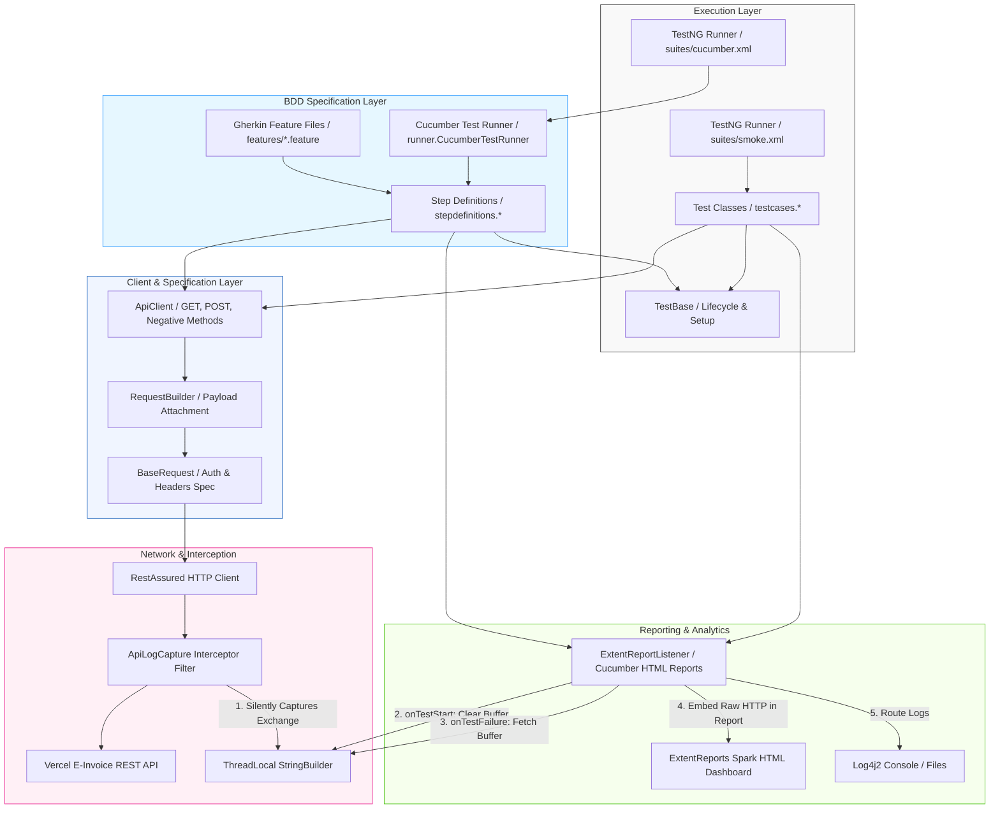

# 🧾 E-Invoicing BDD API Test Automation Framework

[](https://www.oracle.com/java/technologies/downloads/)
[](https://maven.apache.org/)
[](https://cucumber.io/)
[](https://testng.org/)
[](https://rest-assured.io/)
[](https://logging.apache.org/log4j/2.x/)
[](https://www.extentreports.com/)

An enterprise-grade, hybrid BDD API test automation framework built to perform contract, security, boundary, and functional end-to-end testing for critical **E-Invoicing REST APIs**. The framework combines **Cucumber BDD Gherkin specifications** with **Rest Assured** HTTP automation, engineered to run in CI/CD pipelines, support multi-environment runtime execution, and deliver rich dashboard analytics.

---

## 🏗️ Architecture & Request Flow

The framework follows a modular architecture separating test specifications (Gherkin Feature Files & Step Definitions), test execution, payload configuration, and diagnostic logging.



---

## 🛠️ Tech Stack & Technical Rationale

| Technology | Purpose | Strategic Rationale |
| :--- | :--- | :--- |
| **Java 11** | Core Language | Long-term support (LTS) release providing standard class loaders, HTTP client improvements, and robust OOP practices. |
| **Cucumber Java** | BDD Automation | Enables readable Gherkin feature files (`Given`, `When`, `Then`) for business stakeholder visibility and clear test specifications. |
| **RestAssured** | HTTP Operations | Fluent BDD-style API validation, built-in assertion matching, and native JSON parser routing. |
| **TestNG** | Test Orchestration | Advanced annotation ecosystem, parallel test execution, priority-based ordering, and native XML test suite execution with Cucumber integration. |
| **Log4j2** | Logger | Enterprise logging framework with asynchronous appenders, custom layouts, and SLF4J bridges. |
| **ExtentReports** | Reporting | Interactive HTML dashboard generation showing execution metrics, pass/fail ratios, and failure trace embedding. |
| **Jackson Databind** | Serialization & POJOs | High-performance serialization (Java object to JSON) and deserialization (JSON to Java object). |
| **AssertJ & Hamcrest** | Assertions | Fluent, readable assertions providing diagnostic messages on verification failures. |

---

## 🌟 Key Framework Features

### 1. Behavior-Driven Development (BDD) Integration
- Written in business-readable Gherkin syntax inside modular `.feature` files.
- Decouples specification from code, enabling seamless step reuse across API test scenarios.
- Integrated with `io.cucumber.testng.AbstractTestNGCucumberTests` for cross-platform execution.

### 2. Zero-Noise `ThreadLocal` API Log Capture
Traditional API frameworks print every request and response payload to the console, cluttering logs and making failures hard to isolate. 
- **How it works**: A custom RestAssured `Filter` interceptor records raw request and response details into a `ThreadLocal<StringBuilder>` buffer.
- **Why it matters**: During successful test execution, no HTTP details clutter console logs. Upon test failure, the interceptor retrieves the exact request and response headers and payloads for that specific thread for instant troubleshooting.

### 3. Isolated Test Data Mutability
API tests often modify template JSON payloads, which can lead to state contamination across tests when run in parallel.
- **Deep Copy Pattern**: Using Jackson's `ObjectMapper`, `TestBase.java` provides `deepCopyMap(Map<String, Object> original)`. Each test works on a distinct, deep-copied instance of the JSON structure, preserving the original schema templates.

### 4. Comprehensive Testing Taxonomy
Tests are structured across four core validation layers:
1. **Contract Validation**: JSON schema validation using classpath schema definition files to enforce API contracts.
2. **Functional Happy Path**: Verifies successful execution, field mappings, and state changes (e.g., ensuring IRN generation and retrievability).
3. **Security Constraints**: Verifies authorization restrictions (e.g., `401 Unauthorized` responses when auth headers are omitted).
4. **Boundary Validation**: Tests validation logic (e.g., negative values, character limits, missing fields) returning `400 Bad Request` or `409 Conflict`.

---

## 📂 Project Directory Structure

```text
EInvoicing/
├── src/
│   ├── main/
│   │   └── java/
│   │       ├── base/
│   │       │   ├── BaseRequest.java      # Configures base URI, content types, and Auth specs
│   │       │   ├── BaseResponse.java     # Defines reusable 200 OK and 201 Created specifications
│   │       │   └── TestBase.java         # Suite hooks, data deep-copiers, and sample resolvers
│   │       ├── config/
│   │       │   └── ConfigReader.java     # Loads config properties based on target environment
│   │       ├── pojo/
│   │       │   └── ...                   # Strongly-typed Java models for automatic serialization
│   │       ├── rest/
│   │       │   └── RequestBuilder.java   # Combines payload bodies with base request specifications
│   │       └── utils/
│   │           ├── ApiClient.java        # Core API wrapper client for GET/POST operations
│   │           ├── ApiLogCapture.java    # ThreadLocal intercepter capturing request/response logs
│   │           ├── DateTimeUtils.java    # Validation for date formats and ISO-8601 strings
│   │           └── StateCodeUtils.java   # Decodes state code and GSTIN prefixes
│   └── test/
│       ├── java/
│       │   ├── listeners/
│       │   │   └── ExtentReportListener.java  # ExtentReports listener executing lifecycle tasks
│       │   ├── runner/
│       │   │   └── CucumberTestRunner.java    # Cucumber TestNG Runner class
│       │   ├── stepdefinitions/
│       │   │   └── EInvoiceSteps.java         # Step Definition class linking Gherkin to API logic
│       │   └── testcases/
│       │       ├── GetInvoiceTests.java   # Tests for retrieval of invoices (queries, pagination)
│       │       ├── POSTCancelTest.java    # Tests for E-Invoice cancellation flows
│       │       ├── PostGenerateTest.java  # Tests for generating invoice IRNs and QR code data
│       │       └── HealthCheckTest.java   # Basic health verification of microservices
│       └── resources/
│           ├── config/
│           │   ├── config.properties      # Active execution profile (qa, dev, staging)
│           │   └── qa.properties          # Environment configurations (URI, tokens, keys)
│           ├── features/
│           │   └── EInvoiceHealthAndGenerate.feature # Gherkin Feature Files for BDD API tests
│           ├── schemas/
│           │   └── ...                    # JSON schemas for API contract tests
│           ├── sheets/
│           │   └── pincodeToState.xlsx    # Data files for location-based boundary tests
│           └── suites/
│               ├── cucumber.xml           # TestNG suite for running Cucumber BDD tests
│               └── smoke.xml              # TestNG suite XML configuration for unit test cases
├── pom.xml                                # Project object model defining dependencies/plugins
└── reports/                               # Output folder for ExtentReports & Cucumber HTML dashboards
```

---

## 🚀 How to Run & Configure

### 1. Prerequisites
- **Java Development Kit (JDK)**: Version 11 or higher installed and added to your `PATH`.
- **Apache Maven**: Version 3.8+ installed and configured.

### 2. Configuration Profiles
The active environment is controlled by files inside `src/test/resources/config/`.
- `config.properties` sets the default environment:
  ```properties
  env=qa
  ```
- Environment specific details (e.g. `baseURI`, `authType`, `apikey`, `token`) are managed in properties files like `qa.properties`.

### 3. Run Command Execution

**Run Cucumber BDD Test Suite**:
```bash
mvn clean test -DsuiteXmlFile=src/test/resources/suites/cucumber.xml
```

**Run TestNG Unit Test Suite**:
```bash
mvn clean test -DsuiteXmlFile=src/test/resources/suites/smoke.xml
```

**Override Environment via Maven CLI**:
You can switch targets dynamically using the `-Denv` VM argument:
```bash
mvn clean test -Denv=qa -DsuiteXmlFile=src/test/resources/suites/cucumber.xml
```

---

## 📊 Test Execution Reports

Upon suite completion, interactive HTML reports are generated under the `reports/` and `target/cucumber-reports/` folders:
- **Cucumber HTML Report**: `target/cucumber-reports/cucumber-pretty.html`
- **Extent HTML Report**: `reports/TestReport_<yyyy-MM-dd_HH-mm-ss>.html`
- **Features**:
  - **Modern UI Dashboard**: Dark-themed visuals including pie charts showing overall status metrics.
  - **Fail-safe logs**: Click on any failed test to expand the call stack showing the exact Request headers, URL, payload body, Response HTTP status, and response JSON body.
