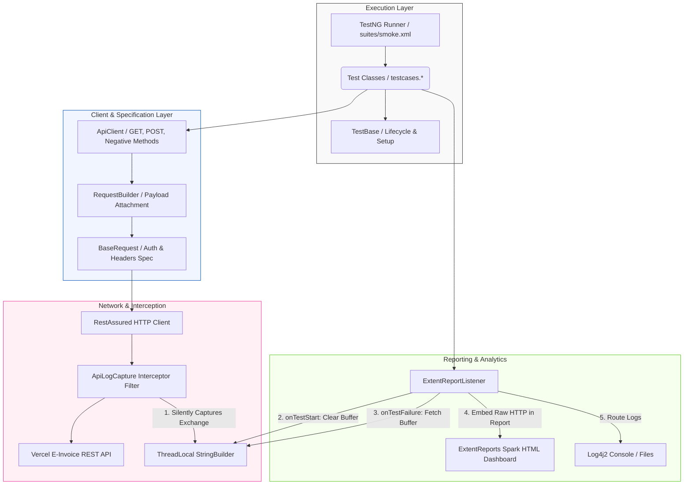

# 🧾 E-Invoicing API Test Automation Framework

[](https://www.oracle.com/java/technologies/downloads/)
[](https://maven.apache.org/)
[](https://testng.org/)
[](https://rest-assured.io/)
[](https://logging.apache.org/log4j/2.x/)
[](https://www.extentreports.com/)

An enterprise-grade, thread-safe API test automation framework built to perform contract, security, boundary, and functional end-to-end testing for critical **E-Invoicing REST APIs**. The framework is engineered to run in CI/CD pipelines, support multi-environment runtime execution, and deliver rich dashboard analytics.

---

## 🏗️ Architecture & Request Flow

The framework follows a modular architecture separating test execution, payload configuration, and diagnostic logging.



---

## 🛠️ Tech Stack & Technical Rationale

| Technology | Purpose | Strategic Rationale |
| :--- | :--- | :--- |
| **Java 11** | Core Language | Long-term support (LTS) release providing standard class loaders, HTTP client improvements, and robust OOP practices. |
| **RestAssured** | HTTP Operations | Fluent BDD-style API validation, built-in assertion matching, and native JSON parser routing. |
| **TestNG** | Test Orchestration | Advanced annotation ecosystem (e.g., `@DataProvider`, `@BeforeSuite`, `@Test(dependsOnMethods=...)`), priority-based ordering, and native XML test suite execution. |
| **Log4j2** | Logger | Enterprise logging framework with asynchronous appenders, custom layouts, and SLF4J bridges. |
| **ExtentReports** | Reporting | Interactive, interactive HTML dashboard generation showing execution metrics, pass/fail ratios, and failure trace embedding. |
| **Jackson Databind** | Serialization & POJOs | High-performance serialization (Java object to JSON) and deserialization (JSON to Java object). |
| **AssertJ** | Assertions | Fluent, readable assertions providing diagnostic messages on verification failures. |

---

## 🌟 Key Framework Features

### 1. Zero-Noise `ThreadLocal` API Log Capture
Traditional API frameworks print every request and response payload to the console, cluttering logs and making failures hard to isolate. 
- **How it works**: A custom RestAssured `Filter` (see [ApiLogCapture.java](file:///c:/Users/Omkar/Downloads/Beautiful%20Journey/Eclipse/EInvoicing/src/main/java/utils/ApiLogCapture.java)) interceptor records raw request and response details into a `ThreadLocal<StringBuilder>` buffer.
- **Why it matters**: During successful test execution, no HTTP details are logged. Upon test failure, the `ExtentReportListener` retrieves the exact request and response headers and payloads for that specific thread, outputting them directly into the ExtentReport HTML file and Log4j2 files for instant troubleshooting.

### 2. Isolated Test Data Mutability
API tests often modify template JSON payloads, which can lead to state contamination across tests when run in parallel.
- **Deep Copy Pattern**: Using Jackson's `ObjectMapper`, [TestBase.java](file:///c:/Users/Omkar/Downloads/Beautiful%20Journey/Eclipse/EInvoicing/src/main/java/base/TestBase.java) provides `deepCopyMap(Map<String, Object> original)`. Each test works on a distinct, deep-copied instance of the JSON structure, preserving the original schema templates.

### 3. Comprehensive Testing Taxonomy
Tests are structured across four core validation layers:
1. **Contract Validation**: JSON schema validation using classpath schema definition files to enforce API contracts (see [schemas/](file:///c:/Users/Omkar/Downloads/Beautiful%20Journey/Eclipse/EInvoicing/src/test/resources/schemas)).
2. **Functional Happy Path**: Verifies successful execution, field mappings, and state changes (e.g., ensuring a cancellation state is persisted upon fetching invoices).
3. **Security Constraints**: Verifies authorization restrictions (e.g., `401 Unauthorized` responses when auth headers are omitted).
4. **Boundary Validation**: Tests validation logic (e.g., negative values, character limits, missing fields) returning `400 Bad Request` or `409 Conflict`.

---

## 📂 Project Directory Structure

```text
EInvoicing/
├── src/
│   ├── main/
│   │   └── java/
│   │       ├── base/
│   │       │   ├── BaseRequest.java      # Configures base URI, content types, and Auth specs
│   │       │   ├── BaseResponse.java     # Defines reusable 200 OK and 201 Created specifications
│   │       │   └── TestBase.java         # Suite hooks, data deep-copiers, and sample resolvers
│   │       ├── config/
│   │       │   └── ConfigReader.java     # Loads config properties based on target environment
│   │       ├── pojo/
│   │       │   └── ...                   # Strongly-typed Java models for automatic serialization
│   │       ├── rest/
│   │       │   └── RequestBuilder.java   # Combines payload bodies with base request specifications
│   │       └── utils/
│   │           ├── ApiClient.java        # Core API wrapper client for GET/POST operations
│   │           ├── ApiLogCapture.java    # ThreadLocal intercepter capturing request/response logs
│   │           ├── DateTimeUtils.java    # Validation for date formats and ISO-8601 strings
│   │           └── StateCodeUtils.java   # Decodes state code and GSTIN prefixes
│   └── test/
│       ├── java/
│       │   ├── listeners/
│       │   │   └── ExtentReportListener.java  # ExtentReports listener executing lifecycle tasks
│       │   └── testcases/
│       │       ├── GetInvoiceTests.java   # Tests for retrieval of invoices (queries, pagination)
│       │       ├── POSTCancelTest.java    # Tests for E-Invoice cancellation flows
│       │       ├── PostGenerateTest.java  # Tests for generating invoice IRNs and QR code data
│       │       └── HealthCheckTest.java   # Basic health verification of microservices
│       └── resources/
│           ├── config/
│           │   ├── config.properties      # Active execution profile (qa, dev, staging)
│           │   └── qa.properties          # Environment configurations (URI, tokens, keys)
│           ├── schemas/
│           │   └── ...                    # JSON schemas for API contract tests
│           ├── sheets/
│           │   └── pincodeToState.xlsx    # Data files for location-based boundary tests
│           └── suites/
│               └── smoke.xml              # TestNG suite XML configuration
├── pom.xml                                # Project object model defining dependencies/plugins
└── reports/                               # Output folder for ExtentReports HTML dashboards
```

---

## 🚀 How to Run & Configure

### 1. Prerequisites
- **Java Development Kit (JDK)**: Version 11 or higher installed and added to your `PATH`.
- **Apache Maven**: Version 3.8+ installed and configured.

### 2. Configuration Profiles
The active environment is controlled by files inside `src/test/resources/config/`.
- [config.properties](file:///c:/Users/Omkar/Downloads/Beautiful%20Journey/Eclipse/EInvoicing/src/test/resources/config/config.properties) sets the default environment:
  ```properties
  env=qa
  ```
- Environment specific details (e.g. `baseURI`, `authType`, `apikey`, `token`) are managed in properties files like [qa.properties](file:///c:/Users/Omkar/Downloads/Beautiful%20Journey/Eclipse/EInvoicing/src/test/resources/config/qa.properties).

### 3. Run Command Execution

**Run all tests in the smoke suite using default environment (QA)**:
```bash
mvn clean test -DsuiteXmlFile=src/test/resources/suites/smoke.xml
```

**Override Environment via Maven CLI**:
You can switch targets dynamically using the `-Denv` VM argument (overriding config.properties):
```bash
mvn clean test -Denv=qa -DsuiteXmlFile=src/test/resources/suites/smoke.xml
```

---

## 📊 Test Execution Reports

Upon suite completion, interactive HTML reports are generated under the `reports/` folder:
- **Location**: `reports/TestReport_<yyyy-MM-dd_HH-mm-ss>.html`
- **Features**:
  - **Modern UI Dashboard**: Dark-themed visuals including pie charts showing overall status metrics.
  - **Fail-safe logs**: Click on any failed test to expand the call stack showing the exact Request headers, URL, payload body, Response HTTP status, and response JSON body.
  - **Parallelism Ready**: Correctly threads separate test execution timelines without mixing logs.
